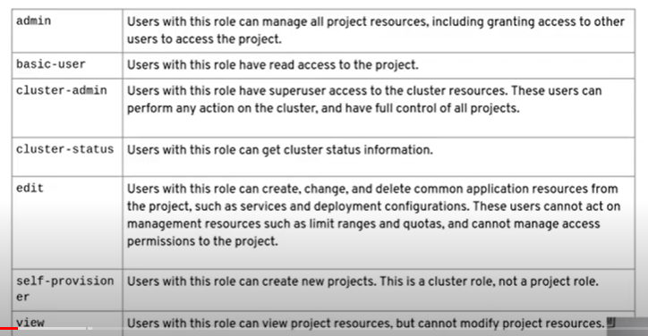

## RBAC

Depending upon the role of the person we will define access.
RBAC mainly have 2 Parts.  

- Users 
- Service Accounts.

### ServiceAccount

When we create pod through deployment or any other resources what the pod can access, whether pod can access to ConfigMaps or Secret.

Two primary thing is User Management and managing the access of the services. 

- For managing RBAC we have 3 major things
  - ServiceAccounts/Users
  - Roles/Cluster Role
  - Cluster Role Binidng.

## Create users in OCP

## IdentityProviders

----------------------------------------

## RBAC

  - cluster role
  - local role

### ROles
