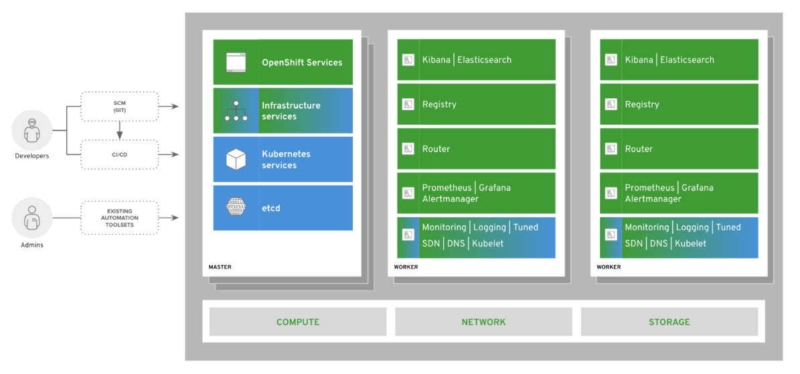

# OPENSHIFT

- Container Orchestartion Platform based on Kubernetes.
- Can do Operations & Development
- Supports most of the Coding Language(Java, python,Ruby, PHP, .NET)
- OCP control plane only can be deployed on RHCOS. (RHCOS is only for OCP deployment)
- OCP workloads can be deployed on RHEL or RHCOS.
  
  
  

## ARCHITECTURE

### Nodes

- OpenShift only runs on RHEL & RHCOS.
- OpenShift has 2 types of nodes.
  - Masters (End-users applications runs)
      - Orchestarte activities on worker node.
      - Maintain the state within OpenShift environment
      - Three masters for HA
  - Workers (Manages the Cluster)

### etcd

- It stores all the data related to the cluster in a key:value pair.
- 

### Containers

- Containers are application run time.
- Images are Application "binary".
- Worker nodes can run many containers.

### Pod

- Pod is the smallest most basic component in the cluster.
- One or more containers can run on a single pod. If multiple containers are running then they share the same storage and network.
- OCP schedules & runs all containers in Pod on same node.

### Service

- It is used to expose the application running on the pods to the outside world. 
- Defines logical set of pods.
- Provides permanent IP address and hostname for the Applications.

## Deployment Strategies

Deployment strategy we can use RollingUpdate & Recreate.
- **RollingUpdate**: 
  - This is used when you want to graudally roll out without downtime.
  - Here new pods are created along with the older ones and thet graduallly replaced one by one.
- **Recreate**: 
  - This is a simplest strategy when you want to recreate all the pods at once.
  - All the pods are terminated and new pods generates. This will give a brief downtime.

