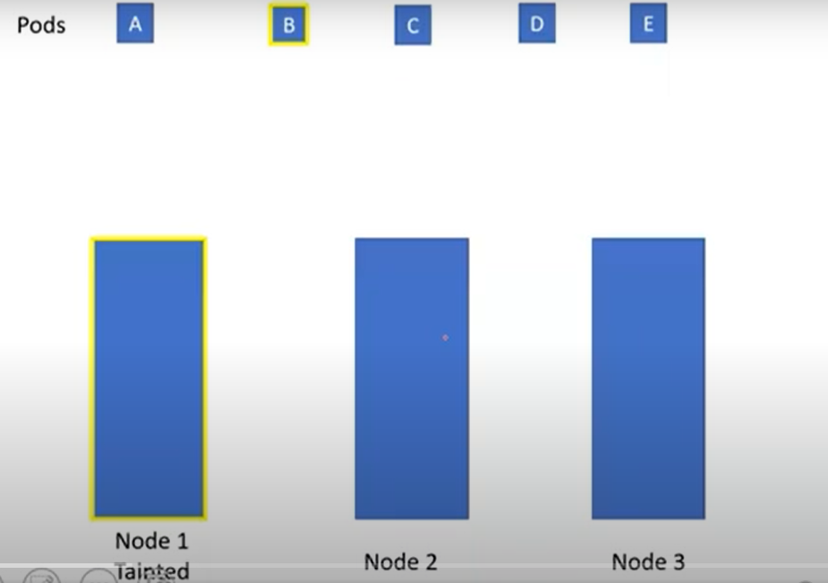
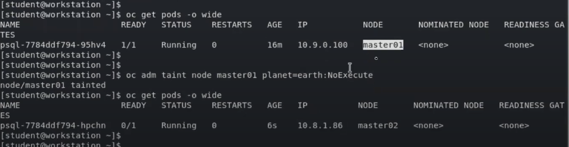

# Taints & Toleration



In the above example we have 3 nodes and 5 pods. Out of which 'Node 1' is tainted and 'Pod B' is tolerated. When Scheduler wants to schedule 'Pod A' to the 'Node 1'. It can't because on which ever node the taint is applied it can schedule. So 'node1' a tainted node will only allow tolerated pod to be scheduled.

## Key Points

- Taints and Toleration is not related to security.
- Taints and Tolerations allow the node to control which pods should be scheduled on them.
- Taint will be applied on nodes.
- Toleration will be applied on Pods. 

## SYNATX & EXAMPLE

### Taint
```
oc adm taint nodes <node-name> <key>=<value>:<effect>

oc adm taint nodes node1 key1=value1:NoExecute
```
**effect --> NoSchedule/PreferNoSchedule/NoExecute**

If we apply 
- NoSchedule - The Pod which doesn't have toleration, will not be scheduled on the node.
- NoExecute - The pods which are already running on the node without having Toleration, these pods will be evicted immeditely
- PreferNoSchedule - The control plane will try to avoid placing a Pod that does not tolerate the taint on the node, but it is not guaranteed.

### Toleration
```
tolerations: 
- key: "key1"
  operator: "Exists"
  effect: "NoExecute"
  tolerationSeconds: 3600
```

### Example



- Check whether taint is applied or not
```
oc describe nodes node1 | grep Taint
```

- Remove taint from a node
```
oc adm taint node node1 planet-
```