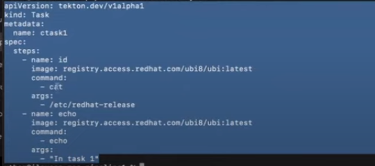
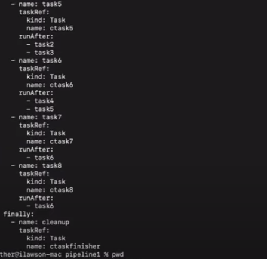
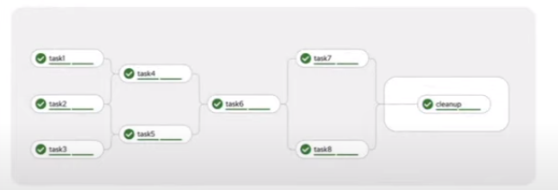

```
tkn pipeline start build-and-deploy -w name=shared-workspace,claimName=source-pvc -p deployment-name=vote-api -p git-url=https://github.com/IBMDeveloperUK/BSOK-vote-api.git -p IMAGE=image-registry.openshift-image-registry.svc:5000/pipelines-tutorial/vote-api
```